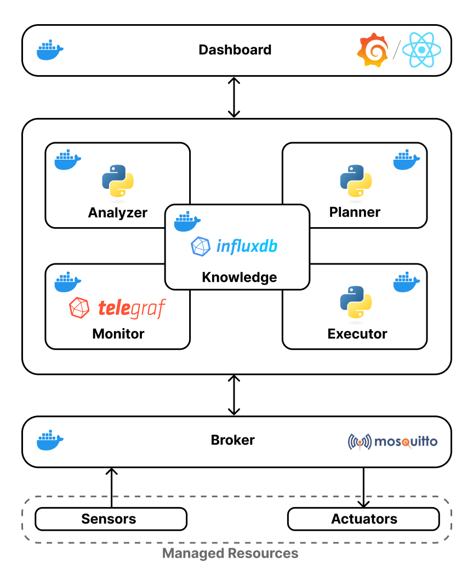

# R.E.C.A.M.  
Renewable Energy Community Autonomic Manager

2024/25  
Software Engineering for Autonomous Systems  
Prof. Davide Di Ruscio

Realized by:

Daniele Borgna \- [daniele.borgna@student.univaq.it](mailto:daniele.borgna@student.univaq.it)  
Omar Dinari \- [omar.dinari@student.univaq.it](mailto:omar.dinari@student.univaq.it)

Table of Contents

[1\. Introduction	3](#1.-introduction)

[2\. Goals	4](#2.-goals)

[2.1. Indices	4](#2.1.-indices)

[2.2. Goal Formulation	5](#2.2.-goal-formulation)

[3\. Managed Resources	6](#3.-managed-resources)

[3.1. Sensors	6](#3.1.-sensors)

[3.2. Actuators	6](#3.2.-actuators)

[4\. Requirements	7](#4.-requirements)

[4.1. Functional Requirements	7](#4.1.-functional-requirements)

[4.2. Non Functional Requirements	7](#4.2.-non-functional-requirements)

[5\. System Architecture	9](#5.-system-architecture)

[5.1. Components	9](#5.1.-components)

---

# 1\. Introduction {#1.-introduction}

The Renewable Energy Community Autonomic Manager (RECAM) is an autonomous system designed to efficiently manage renewable energy resources, such as solar panels and wind turbines, within Renewable Energy Communities (REC). These communities consist of individuals, businesses, or public entities working together to produce, share, and manage renewable energy at a local level.

The primary goals of RECAM are to maximize self-consumption, minimize dependence on external energy sources, and ensure equitable energy distribution among community members. The system incorporates mechanisms to manage specific "optional" electronic devices within the community, such as appliances or lights, activating them only when sufficient energy is available. If energy is insufficient, users will be notified that certain devices could not be activated for the day. However, devices marked as critical will still be activated, possibly utilizing external energy sources.

RECAM employs a proactive strategy to balance energy production, consumption, and storage. A key feature of the system is its **predictive model**, which forecasts energy trends to optimize resource management.

All functionalities of the system will be elaborated in the requirements section, with priorities assigned to identify the most essential features. Additionally, the technologies employed will be detailed in a dedicated section.

--- 

# 2\. Goals {#2.-goals}

As previously mentioned, the primary objective of the system is to optimize energy usage by:

* Fulfill all the members' requirements.  
* Maximizing self-consumption of renewable energy.  
* Minimizing reliance on external energy sources.

## 2.1. Indices  {#2.1.-indices}

To implement these goals, we define some indices used by the system.

| Name | Variable |
| :---- | :---- |
| Number of members of the REC | K |
| Members of the REC | m1 ...,mK |
| Producer devices for the member i | pi,1,...,pi,Ni |
| Consumer devices for the member i | ci,1,...,ci,Mi |
| Instantaneous production in kW of a producer device | (pi,n) |
| Consumption in kW of a consumer device | (ci,m) |
| Requested time in hours of a consumer device | (ci,m) |
| Requested deadline in hours for a consumer device | (ci,m) |
| Energy in kWh stored in batteries | s |

### Explanation

Each member mi of the REC contributes to energy generation through production devices pi,n, each of which has an instantaneous production of energy in kW equal to (pi,n). The energy that each producer generates is stored in batteries and the total amount of energy stored in kW is equal to s. Each member also owns consumption devices ci,m, each of which consumes a power amount in kW equal to (ci,m). Assuming these devices are smart and can be remotely activated without human intervention, each member will specify a required usage time for each device during the day (ci,m). Consequently, the daily energy consumption in kWh required for the device ci,m will be equal to (ci,m)(ci,m). The deadline in hours represents the number of hours within which the required usage time for a given consumer must be met. For example, if a consumer is assigned \=2 e \=6, it means that within 4 hours the device must start, regardless of the energy availability in the battery.

## 2.2. Goal Formulation {#2.2.-goal-formulation}

Once all the indices of the system have been defined, we can mathematically represent the two formulas that represent the goals of the system. The two formulas are written in order of priority and the first one addresses the requirements of the members:

(ci,m)  (ci,m)  ci,m

This implies that for each consumer, the requested usage time must be fulfilled before the specified deadline. The second formula encapsulates two goals and is as follows:   
s-i=0Km=0Mi(ci,m)(ci,m))0

This formula reflects both goals because: 

* When s\>i=0Km=0Mi(ci,m)(ci,m)): Approaching zero means that all the stored energy needs to be consumed.   
* When  s\<i=0Km=0Mi(ci,m)(ci,m)): Approaching zero ensures that the use of external energy is minimized as much as possible.

---

# 3\. Managed Resources {#3.-managed-resources}

As mentioned in the previous chapter, the system consists of various elements, including REC members, energy producers pi,n, energy consumers ci,m, and batteries. To properly define the system, we will identify which components serve as sensors and which function as actuators.

## 3.1. Sensors {#3.1.-sensors}

The sensors used by the system are:

1. Battery level sensor: A sensor that measures the energy stored in the REC batteries.  
2. User dashboards: Dashboards that collect temporal data regarding the consumers, specifically  (time of use) and  (deadline).  
3. Energy production sensor (optional): A sensor that measures the energy production of each producer. This sensor is optional, as the application primarily requires measuring the energy stored in the battery, which aggregates all the energy produced by the producers. However, it is useful to monitor this data to provide users with an overview of the producers' energy production.

## 3.2. Actuators {#3.2.-actuators}

The system includes a single type of actuator: a switch for each consumer. This switch is responsible for starting the operation of the respective device. Each consumer is equipped with its own dedicated actuator, ensuring individual control. Once a device is activated, it is assumed that its operation will continue uninterrupted until the requested usage time is fully satisfied. This design ensures simplicity and reliability in managing the execution of the devices while adhering to the system's operational constraints and goals.

---
# 4\. Requirements {#4.-requirements}

This chapter provides a detailed overview of all the system requirements, categorized into functional and non-functional requirements. Functional requirements define the specific behaviors and operations the system must perform, while non-functional requirements address the overall quality, performance, and constraints under which the system operates. Together, these requirements establish a comprehensive framework for understanding the system's capabilities and limitations.

## 4.1. Functional Requirements {#4.1.-functional-requirements}

The functional requirements of the system are presented in a table format. Each requirement is assigned to one of the four categories (C) in the MAPE-K loop, that are Monitoring (M), Analyzing (A), Planning (P), Executing (E). The last column of the table indicates the priority (P) of each requirement, ranked on a scale from 1 (low priority) to 3 (high priority). This prioritization helps in identifying the most critical functionalities that need to be addressed during system implementation.

| ID | Name | Description | C | P |
| :---- | :---- | :---- | :---- | :---- |
| FR1 | Monitor Battery Levels | The system must continuously monitor the energy stored in the REC batteries and update users. | M | 3 |
| FR2 | Collect Temporal Data | The system must gather and store temporal data regarding usage time  and deadlines . | M | 3 |
| FR3 | Control Device Activation | The system must activate consumers remotely based on energy availability, usage time, and deadlines. | E | 3 |
| FR4 | Forecast Energy Trends | The system must use predictive models to forecast energy production and consumption trends. | A | 2 |
| FR5 | Balance Energy Consumption | The system must ensure that stored energy is consumed efficiently while minimizing reliance on external energy sources. | P | 3 |
| FR6 | Provide Production Insights | The system must monitor and display the energy production of each producer. | M | 1 |

## 4.2. Non Functional Requirements {#4.2.-non-functional-requirements}

Similarly to what was done for the functional requirements, we present the most important non-functional requirements for our project in a table structured similarly to the previous one. The main difference is the absence of the MAPE-K category, as these requirements pertain to the system as a whole.

| ID | Name | Description | P |
| :---- | :---- | :---- | :---- |
| NFR1 | Scalability | The system must support an increasing number of REC members and devices without issues. | 3 |
| NFR2 | Performance | The system must ensure fast and efficient operation, minimizing delays in energy management actions. | 2 |
| NFR3 | Usability | The user interface must be intuitive and accessible to users with varying levels of technical expertise. | 1 |
| NFR4 | Reliability | The system must ensure continuous and fault-tolerant operation to prevent interruptions. | 3 |

---

# 5\. System Architecture {#5.-system-architecture}

The following image represents the components of the system. 

## 5.1. Components {#5.1.-components}

### Dashboard

In the dashboard, the user can:

1. View raw data related to energy production and consumption.  
2. Interact with the system to specify the values of  (requested usage time) and  (deadline) for each of their consumer devices.

The first dashboard is developed using Grafana, which provides an intuitive and modern interface to display system data through interactive graphs.  
The second dashboard is built using React for the frontend and a Go backend, enabling seamless interaction and efficient management of user inputs.

### Managed Resources

The sensors and actuators are simulated using Python scripts. Specifically:

1. Sensors: They simulate realistic values for energy production as well as  and for consumer devices.  
2. Actuators: They handle the activation of devices requested by the users.

### Broker

The broker used in the system is implemented with Mosquitto. The following topics are utilized:

1. /producer/\<producer\_id\>: The sensor reading the production of a producer sends the amount of energy generated within a specific time frame.  
2. /battery: The sensor monitoring the battery level sends the energy stored in the battery at regular intervals.  
3. /consumer/activation/\<consumer\_id\>: The system sends a message on this topic to activate the consumer with the specified ID.  
   

Additionally, for the purpose of simulation, topics related to  and  are defined:

4. /consumer/tau/\<consumer\_id\>: Simulates the assignment of  to the specified consumer.  
5. /consumer/delta/\<consumer\_id\>: Simulates the assignment of  to the specified consumer.  
   

### Monitor

The monitor is implemented using Telegraf and is responsible for forwarding data from Mosquitto to the knowledge base, filtering only the topics that serve as inputs to the system. 

### Analyzer

The data stored in the knowledge base is analyzed to determine which consumers can be activated and under what conditions. This information is then passed to the planner. 

### Planner

The planner decides which of the consumers identified by the analyzer should actually be activated. The decision is then forwarded to the executor. 

### Executor

The executor sends instructions to the actuators, specifying which consumers, if any, should be activated. 

### Knowledge

The knowledge base is maintained in a time-series database, InfluxDB, where specific buckets are used to store: 

1. Energy production data for each producer.  
2. Battery charge levels.  
3.  and  for the consumers.  
4. Activation orders sent by the executor.
