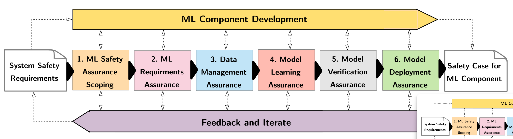

# AMLAS 

Machine Learning is now used in a range of systems with results that sometimes exceed human performance. AMLAS is a methodology to **A**ssucance of **M**achine **L**earning for use in **A**utonomous **S**ystems. It comprises a set of safety case patterns and process for:
1. Systematically integrating safety assurance into ML components of an Autonomous System
2. Generating the evidence base to explicit justify the acceptable safety of ML components when included in Autonomous Systems. 

The AMLAS process is composed by six *stages*, each one gives its input to the next one.

This activities are performed in parallel to the development process of the ML components. The aim of this project is to provide guidance on how to systematically integrate safety assurance into the development of only the ML components, and not any others kind of them. Particularly, the primary focus is on off-line supervised learning, particularly applied to classification tasks and predominant application of ML for Autonomous Systems.

## Overview of the Stages in AMLAS
Now a brief summary of what each stage in AMLAS does:
* **Stage 1: ML Safety Assurance Scoping**: This stage focuses on defining the scope of the safety assurance process for the ML component. The goal is to establish a clear link between the system-level safety requirements and the safety requirements specific to the ML component. This includes identifying the system safety requirements allocated to the ML component, defining the operational environment of the system, and describing the ML component itself. A scoping argument is generated to justify the scope of assurance and provide context for subsequent assurance activities.
* **Stage 2: ML Safety Requirements Assurance**
The purpose of this stage is to develop ML-specific safety requirements from the system safety requirements allocated to the ML component. This process requires translating complex real-world concepts and cognitive decisions into measurable and verifiable requirements for the ML model. The ML safety requirements must be validated against the system safety requirements, the system architecture, and the operational environment. An assurance argument is created to justify the ML safety requirements and the validation process, highlighting any trade-offs, assumptions, and uncertainties.
* **Stage 3: Data Management**
This stage focuses on managing the data used for developing, testing, and verifying the ML model. Data requirements are defined to ensure that the data collected is sufficient to create an ML model that satisfies the safety requirements. Three separate datasets are generated for development, internal testing, and verification. The datasets are then validated to check that they meet the data requirements. An assurance argument is created to justify the data requirements, the generation process, and the validation results.
* **Stage 4: Model Learning**
This stage focuses on developing and testing the ML model. Using the development data, an ML model is created to satisfy the ML safety requirements. The model is then tested using the internal test data to assess its performance against the safety requirements. If the model does not satisfy the requirements, the model learning process or data management may need to be revisited. An assurance argument is created to justify the model learning process, the test results, and the selection of the final model.
* **Stage 5: Model Verification**
This stage focuses on verifying that the ML model satisfies the safety requirements when exposed to inputs not present during model development. This may include using test-based verification techniques, such as running the model on an independent verification dataset, or formal verification techniques. An assurance argument is created to demonstrate the relationship between the verification evidence and the ML safety requirements, explaining any trade-offs, assumptions, and uncertainties.
* **Stage 6: Model Deployment**
This stage focuses on integrating the ML model into the target system and ensuring that the safety requirements are satisfied during system operation. The ML model is integrated into the system architecture and tested using defined operational scenarios. Mechanisms are implemented to monitor the system's behavior and manage any errors or assumption violations. An assurance argument is created to demonstrate that the ML model continues to satisfy the safety requirements once integrated into the target system.