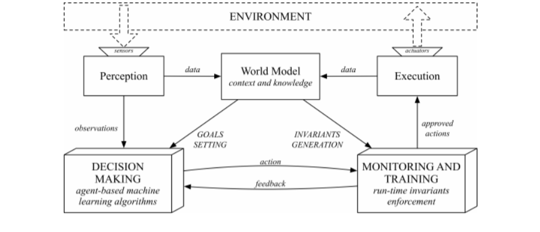

# Invariants Assurance Techniques for ML-based Autonomous Systems

Autonomous Systems are continuously exposed to the unpredictability of the environment. This can lead to uncertainties in the system behaviors; it is, in fact, hard or impossible to explicitly model the behavior of the system for each situation. ML, and in particular reinforcement learning, for generating the actions to be taken by the autonomous system and in this way, we plan to achieve the self-adaptability. Because the actions are not generated by deterministic algorithms, we can not assure that they are always compliant with the system's requirements and in particular system's safety-critical ones, called *invariants*. 

## Proposed method
The proposed method describes how to organize the system structure in order to achieve this goal. In particular, we have the following components:
* **Perception and Execution**: the perception of the environment is a semantic representation of the raw data coming from the sensor, while the execution component applies the actions on the external environment.
* **World model**: keeps track of both the external environment and the internal state of the system, setting the goals to be achieved and the invariants to be maintained.
* **Decision making**: generates actions from the observations and the goals. It continuously improves receiving feedbacks about the generated actions.
* **Monitoring and training**: monitors the actions taken by the decision-making component preventing invariants violations. It also trains the ML algorithms by sending positive or negative feedbacks, according with how is the action good reflecting on the invariants.

